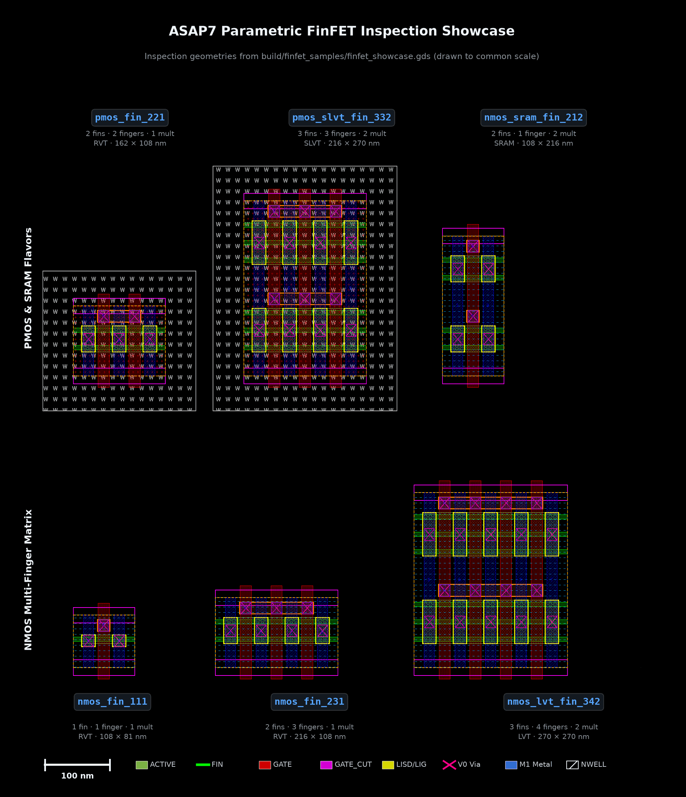

# Parametric FinFET: `chipforge_asap7.devices.finfet`

A four-terminal, multi-finger ASAP7 FinFET built on the grid primitives of
`chipforge_asap7.layout` (see the [README](../README.md#chipforge_asap7layout)).
It drops the continuous `width` knob used by planar generators: a FinFET's drive
strength comes in whole fins, so the device takes three **discrete counts** and
is named after them. 

```python
from chipforge_asap7.devices import FinFETSpec, nmos_fin, pmos_fin

cell = nmos_fin(fins=1, fingers=2, multipliers=2)  # cell.name == "nmos_fin_122"
spec = FinFETSpec(flavor="p", fins=3, fingers=4)  # "pmos_fin_341"
spec.width, spec.height  # 432, 216  (nm), including tap/routing geometry
spec.gate_xs, spec.sd_xs  # [189, 243, 297, 351], [162, 216, 270, 324, 378]
spec.total_fins  # 12
spec.netlist()  # M0 D G S B pmos_rvt nfin=3 l=20n nf=4 m=1
lvt = FinFETSpec(vt="lvt")  # model nmos_lvt, cell nmos_lvt_fin_111
```

`nmos_fin_122` reads *1 fin, 2 fingers, 2 multipliers* — the same fin-count
nomenclature as OpenFinRAM's `sram_cell_6t_122` (`nfin_pu=1, nfin_pd=2,
nfin_pg=2`), rather than the planar `W=3u` style. Counts of 10 or more switch
to `_`-separated fields (`12_2_1`) so `1,12,1` and `11,2,1` can't collide.

Fins sit on the 27 nm fin pitch, gates on the 54 nm contacted-poly pitch, and
source/drain columns midway between gates — fingers share the column between
them. Multipliers are folded into additional physical fingers, preserving
`fins * fingers * multipliers` channel intersections in one interdigitated row.
LIG joins every active gate, and standard-cell-style M1 conductors physically
tie all source columns and all drain columns. A separate opposite-polarity tap
column exposes the real B terminal, so the generated cell has four independent
M1 pins: D, G, S and B.

The geometry is based on the released `INVxp33_ASAP7_75t_R` and
`TAPCELL_ASAP7_75t_R`: full FIN/GATE grids, edge dummy gates,
fin-quantized ACTIVE, legal select/well enclosure, split gate cuts, 24 nm LISD,
matching 24 nm SDT source/drain markers, 18 nm V0, and minimum-area M1
landings. RVT is the default; `vt="lvt"`,
`"slvt"` and `"sram"` select the matching model and marker.

## FinFET showcase

The inspection set in [`build/finfet_samples/`](../build/finfet_samples) illustrates how fin counts, finger counts, multiplier folding, and threshold voltage variants map onto physical ASAP7 silicon geometries:



| Device | Configuration | Size (nm) | Model / VT | Architectural Highlights |
| --- | --- | ---: | --- | --- |
| `nmos_fin_111` | 1 fin, 1 finger, 1 multiplier | 108 × 81 | `nmos_rvt` | Minimal unit FinFET; 1 channel intersection, edge dummy gates |
| `nmos_fin_231` | 2 fins, 3 fingers, 1 multiplier | 216 × 108 | `nmos_rvt` | 3 shared fingers; interdigitated source/drain columns on M1 |
| `nmos_lvt_fin_342` | 3 fins, 4 fingers, 2 multipliers | 270 × 270 | `nmos_lvt` | Multipliers folded into 8 physical fingers; LVT marker layer |
| `pmos_fin_221` | 2 fins, 2 fingers, 1 multiplier | 162 × 108 | `pmos_rvt` | PMOS device with NWELL enclosure and PSELECT implant |
| `pmos_slvt_fin_332` | 3 fins, 3 fingers, 2 multipliers | 216 × 270 | `pmos_slvt` | 3-fin PMOS with folded multipliers and SLVT marker layer |
| `nmos_sram_fin_212` | 2 fins, 1 finger, 2 multipliers | 108 × 216 | `nmos_sram` | Folded multiplier NMOS with SRAMVT threshold marker |

The top cell `FINFET_SHOWCASE` in `build/finfet_samples/finfet_showcase.gds` places all six inspection devices side-by-side to a common scale. Each cell demonstrates the full 27 nm FIN and 54 nm GATE manufacturing grids, split gate cuts (GCUT), local interconnect (LIG/LISD), and contacts (V0) to M1 landing pads.

## Verification and DRC ceilings

The generator only accepts the DRC-legal device grid: 20 nm gate length, one
54 nm CPP, one through `MAX_FINS` (18) fins, and no arbitrary `sd_dx`.
`row_height` may be enlarged only in whole fin pitches and must leave enough
select enclosure for the body tap. Invalid requests raise instead of silently
producing dirty GDS.

Two ceilings, for two different reasons. `MAX_VERIFIABLE_FINS` (12) is where
the *public KLayout runset* stops: it spells `ACTIVE.W.2` / `SDT.W.3`
("height is an integer multiple of 27 nm") as an enumerated list of twelve
heights, because KLayout has no integer-multiple predicate, so it reports a
false violation on anything taller. That is a property of the deck, not of
ASAP7 — the released SRAM banks ship 13-, 14- and 18-fin devices
(`dec_inv_62f_halved_AND` in `asap7_sram_0p0` has both an 18-fin and a 13-fin
pair), and running the same runset on ASU's own cell reports those two rules.
`MAX_FINS` (18) is therefore the device limit, set from the tallest device in
the released collateral. `FinFETSpec.drc_verifiable` reports which side of the
line a device falls on.

`tests/test_finfet_drc.py` runs a representative NMOS/PMOS, VT, fin, finger,
multiplier and row-height matrix through the public ASAP7 KLayout runset,
restricted to `drc_verifiable` specs, and asserts it is clean. A companion test
builds the 13- and 18-fin devices and asserts the runset's violation set is
*exactly* `{ACTIVE.W.2, SDT.W.3}` — so a real violation on a tall device shows
up as a new category, and a future deck that fixes the enumeration fails the
test and lets `MAX_VERIFIABLE_FINS` be raised. Both auto-discover this
workspace's tools or accept `KLAYOUT_BIN` and `ASAP7_DRC_DECK`; set
`ASAP7_REQUIRE_TOOLS=1` to turn "tool not installed" skips into failures. `tests/test_finfet_connectivity.py` independently subtracts
GCUT, traces LI/V0/M1 connectivity, proves D/G/S/B are separate, and checks the
physical channel count. The public educational runset is the DRC authority for
this project; it is not a claim of commercial foundry sign-off.

```bash
uv run asap7-finfet --fins 2 --fingers 2 --multipliers 2 --out build/nmos_fin_222.gds
```

---

See also:
- [Cell generators index](devices.md)
- [Row decoder and standard-cell row logic](row_decoder.md)
- [Column IO and bitline periphery](column_io.md)
- [Simulation and verification](verification.md)
